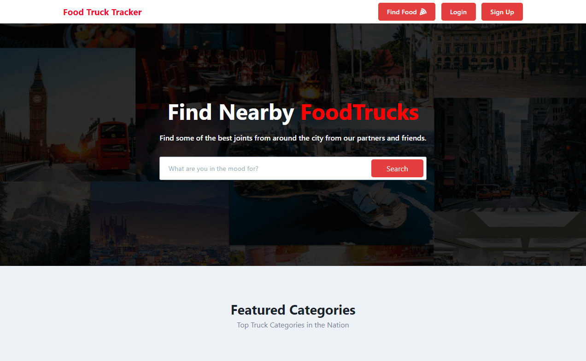

# Hi there, I'm Mark! 👋

### Full Stack Software Engineer

I am a Software Engineer who is passionate about interactive media, from web applications to virtual reality games. I love to solve problems while leading and lifting others around me.

- 🔭 I’m currently working on [**Learnwind.io**](https://learnwind.io)

- 🌱 I’m currently learning and working towards my **Google & Azure Cloud Certifications**

- 👨‍💻 All of my projects are available at [**markambrocio.com**](https://markambrocio.com)

- 🎖️ I am a **U.S. Army Veteran.**

- 🎉 I am a [**Bootcamp Graduate!**](https://www.credly.com/badges/572f9292-79b4-4e94-b3b0-6b45d910a174/public_url)

- ⚡ Fun fact: **I moonlight as an Indie Game Dev on [twitch][twitch]**

## View my JavaScript / TypeScript Projects:

_Frontend + Backend; Newest - Oldest_

<table>
  <tr>
    <td align="center">
      <a href="https://github.com/markanator/fullstack-vr-funding">
         
        
          <b>
            Virtual Reality Funds
          </b>
        
      </a> 
      

        
        
        
        
        
      

    </td>
    <td align="center">
      <a href="https://github.com/markanator/slick-slice">
         
        
          <b>
            Mike's Pizza - Slick Slice
          </b>
        
      </a> 
      

        
        
      

    </td>
    <td align="center">
      <a href="https://github.com/markanator/rosemary-personal-financee">
         
        
          <b>
            Rosemary Personal Finance
          </b>
        
      </a> 
      

        
        
      

    </td>
  <td align="center">
      <a href="https://github.com/markanator/fullstack-foodtruck-trackr">
         
        
          <b>
            Food Truck Track'R
          </b>
        
      </a> 
      

        
        
        
      

    </td>
  </tr>
  <tr>
    <td align="center">
      <a href="https://github.com/markanator/dang-thats-delicious">
         
        
          <b>
            Dang That's Delicious
          </b>
        
      </a> 
      

        
        
        
      

    </td>
  <td align="center">
      <a href="https://github.com/markanator/portfolio">
         
        
          <b>
            Portfolio
          </b>
        
      </a> 
      

        
        
      

    </td>
  </tr>
</table>
<!-- 
 -->

## View my C# Projects

_Newest - Oldest_

<table>
  <tr>
    <td align="center">
      <a href="https://github.com/markanator/csharp-ticket-tracker">
         
        
          <b>
            The Bug Tracker
          </b>
        
      </a> 
      

      
      
      
MVC

      
      
      

    </td>
    <td align="center">
      <a href="https://github.com/markanator/csharp_AmbroBlogProject">
         
        
          <b>
            Personal Blog
          </b>
        
      </a> 
      

      
      
      
MVC

      
      
      

    </td>
    <td align="center">
      <a href="https://github.com/markanator/csharp-sports-app">
         
        
          <b>
            Sports League Management
          </b>
        
      </a> 
      

      
      
      
MVC

      
      
      

    </td>
    <td align="center">
      <a href="https://github.com/markanator/csharp-currency-app">
         
        
          <b>
            Currency Management App
          </b>
        
      </a> 
      

      
      
WPF

      

    </td>
  </tr>
  <tr>
    <td align="center">
      <a href="https://github.com/markanator/csharp-virtual-eco-system">
         
        
          <b>
            Virtual Ecosystem App
          </b>
        
      </a> 
      

      
      
      

    </td>
  </tr>
</table>

[website]: https://markambrocio.com
[twitter]: https://twitter.com/_mark_ambro
[linkedin]: https://www.linkedin.com/in/mark-ambro/
[twitch]: https://www.twitch.tv/palante_mark
